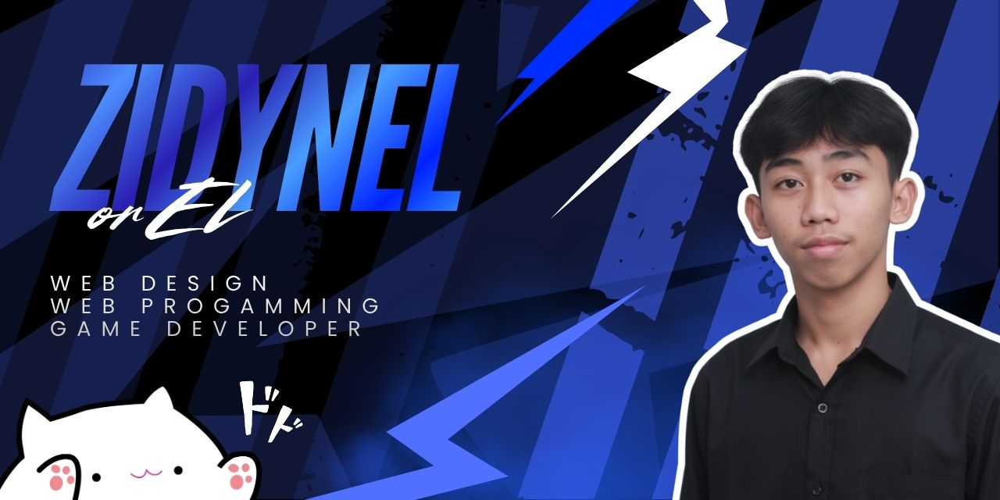

## Hi Gang! I'm Ell👋

<!--
**yazz05/yazz05** is a ✨ _special_ ✨ repository because its `README.md` (this file) appears on your GitHub profile.

Here are some ideas to get you started:

- 🔭 I’m currently working on ...
- 🌱 I’m currently learning ...
- 👯 I’m looking to collaborate on ...
- 🤔 I’m looking for help with ...
- 💬 Ask me about ...
- 📫 How to reach me: ...
- 😄 Pronouns: ...
- ⚡ Fun fact: ...
-->

- 🎓 Informatics Student
- 💻 Interested in Web Development & Game Development
- 🔥 Learning Laravel & Filament
- 📚 Exploring Backend & Frontend Development
- 🎯 Goal: Become a Professional Software Engineer

#### skills

          

